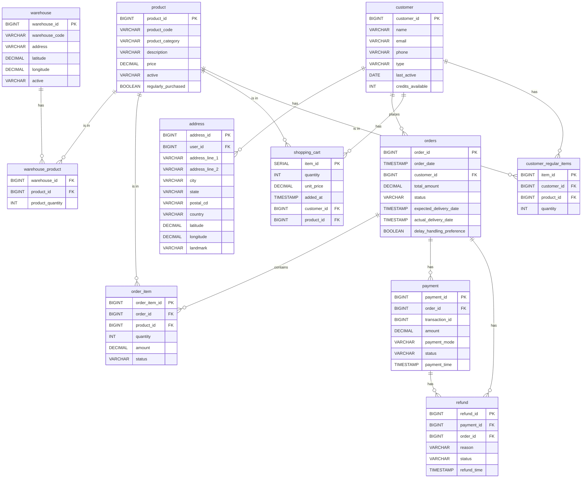

```mermaid
erDiagram
    customer {
        BIGINT customer_id PK
        VARCHAR name
        VARCHAR email
        VARCHAR phone
        VARCHAR type
        DATE last_active
        INT credits_available
    }
    product {
        BIGINT product_id PK
        VARCHAR product_code
        VARCHAR product_category
        VARCHAR description
        DECIMAL price
        VARCHAR active
        BOOLEAN regularly_purchased
    }
    address {
        BIGINT address_id PK
        BIGINT user_id FK
        VARCHAR address_line_1
        VARCHAR address_line_2
        VARCHAR city
        VARCHAR state
        VARCHAR postal_cd
        VARCHAR country
        DECIMAL latitude
        DECIMAL longitude
        VARCHAR landmark
    }
    warehouse {
        BIGINT warehouse_id PK
        VARCHAR warehouse_code
        VARCHAR address
        DECIMAL latitude
        DECIMAL longitude
        VARCHAR active
    }
    warehouse_product {
        BIGINT warehouse_id FK
        BIGINT product_id FK
        INT product_quantity
    }
    orders {
        BIGINT order_id PK
        TIMESTAMP order_date
        BIGINT customer_id FK
        DECIMAL total_amount
        VARCHAR status
        TIMESTAMP expected_delivery_date
        TIMESTAMP actual_delivery_date
        BOOLEAN delay_handling_preference
    }
    order_item {
        BIGINT order_item_id PK
        BIGINT order_id FK
        BIGINT product_id FK
        INT quantity
        DECIMAL amount
        VARCHAR status
    }
    payment {
        BIGINT payment_id PK
        BIGINT order_id FK
        BIGINT transaction_id
        DECIMAL amount
        VARCHAR payment_mode
        VARCHAR status
        TIMESTAMP payment_time
    }
    refund {
        BIGINT refund_id PK
        BIGINT payment_id FK
        BIGINT order_id FK
        VARCHAR reason
        VARCHAR status
        TIMESTAMP refund_time
    }
    shopping_cart {
        SERIAL item_id PK
        INT quantity
        DECIMAL unit_price
        TIMESTAMP added_at
        BIGINT customer_id FK
        BIGINT product_id FK
    }
    customer_regular_items {
        BIGINT item_id PK
        BIGINT customer_id FK
        BIGINT product_id FK
        INT quantity
    }

    customer ||--o{ address : "has"
    customer ||--o{ orders : "places"
    customer ||--o{ shopping_cart : "has"
    customer ||--o{ customer_regular_items : "has"
    product ||--o{ warehouse_product : "is in"
    product ||--o{ order_item : "is in"
    product ||--o{ shopping_cart : "is in"
    product ||--o{ customer_regular_items : "is in"
    warehouse ||--o{ warehouse_product : "has"
    orders ||--o{ order_item : "contains"
    orders ||--o{ payment : "has"
    orders ||--o{ refund : "has"
    payment ||--o{ refund : "has"
```
